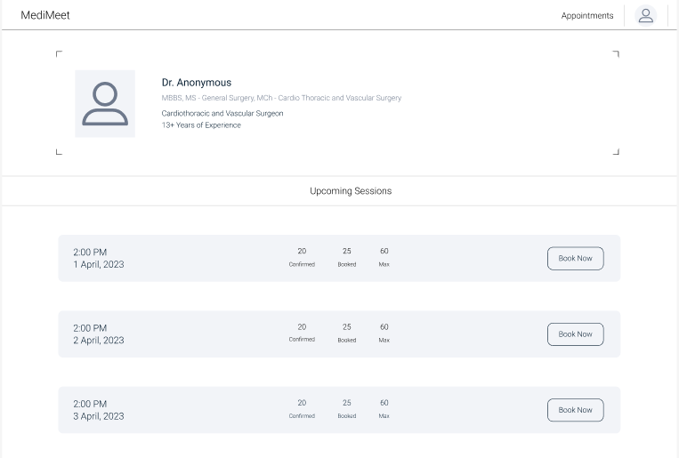
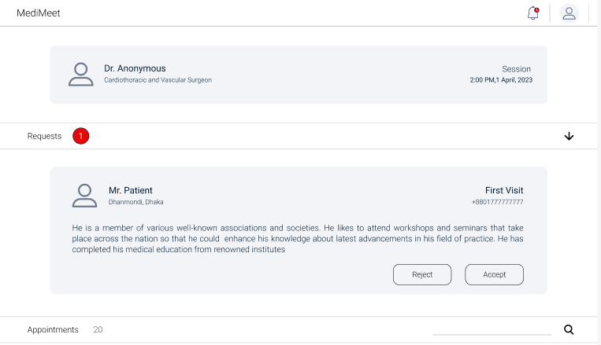
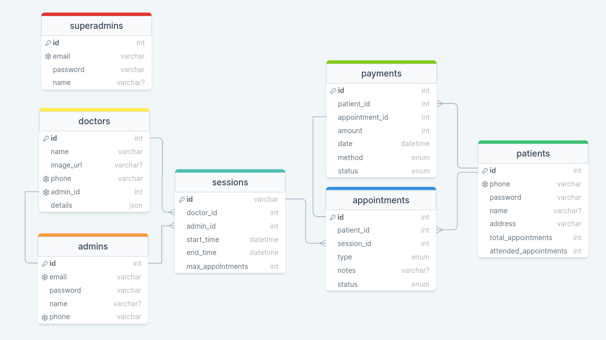
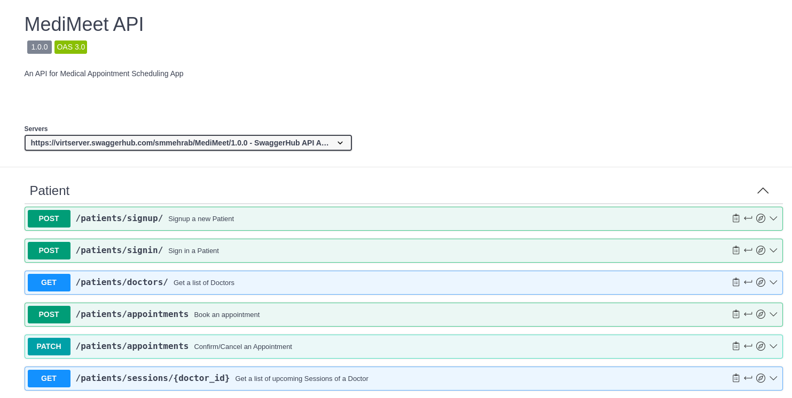

# MediMeet: Medical Appointment Scheduling App

Welcome to [MediMeet](https://github.com/smmehrab/medimeet), a comprehensive medical appointment scheduling application designed to streamline the process of booking and managing appointments for patients, doctors, and hospital authorities.

This application is built with the aim to simplify the healthcare experience for all stakeholders involved. It provides a seamless interface for patients to book appointments with their preferred doctors, confirm appointments through a secure payment gateway, and receive timely notifications about their appointments.

For doctors and their assistants, MediMeet serves as a robust platform to manage appointments, set appointment types, and even control appointment cancellation deadlines. The application also empowers them with the ability to ban patients if necessary.

Hospital authorities, acting as super-admins, can efficiently manage the roster of doctors, assign sessions & slots, and assign admins for each doctor. They also have the authority to remove doctors or admins if required.

[Demo Video - Only Backend](https://youtu.be/4IV55TxrzOQ?feature=shared)

## Technology Used

* Backend: [Python (Django)](https://www.djangoproject.com/)
* Database: [PostgreSQL](https://www.postgresql.org/)
* SMS: [sms.net.bd](https://www.sms.net.bd/api)
* Payment Gateway: [Bkash](https://developer.bka.sh/docs)
* Deployment: [Render](https://render.com/)
* API Documentation: [Swagger](https://swagger.io/)
* API Testing: [Postman](https://www.postman.com/)

## GUI Design

[View Details](https://www.figma.com/file/PHXYYmE8i1wVXCV62KWAqP/MediMeet?node-id=0%3A1&t=1ePotSYSopnCsaTA-1)

<div style="display: flex; justify-content: space-between;">
  
  
</div>

## Database Design

[View Details](https://drawsql.app/teams/smmehrab/diagrams/medimeet-database)



## APIs

[View All APIs](https://app.swaggerhub.com/apis/smmehrab/MediMeet/1.0.0)



## Getting Started

### Prerequisites

- [Python](https://www.python.org/)
- [pipenv](https://pipenv.pypa.io/)

### Installation

```
git clone https://github.com/smmehrab/medimeet.git
cd medimeet
pipenv install
```

### Run

1. Run migrations
   ```
   pipenv run python manage.py migrate
   ```
2. Create a superuser for the admin interface
   ```
   pipenv run python manage.py createsuperuser
   ```
3. Start the development server
   ```
   pipenv run python manage.py runserver
   ```

Visit [http://127.0.0.1:8000/](http://127.0.0.1:8000/) in your web browser.

## Future

Hopefully, someone will build the frontend for it.
